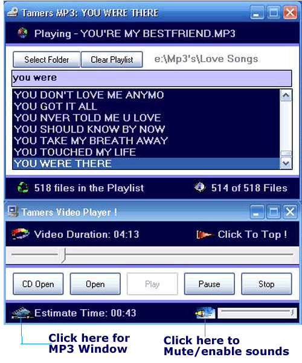



## Video/MP3 Player Updated \!

### Description

I've been using this program for almost a month mow and it works perfectly on slower Machines. Codes are straight forward. So, beginners can easily understand the flow of the program. This is my update of my last submission which is purely video player. I added an MP3 player window for an ease of use when playing mp3 files. Have a nice day to all ! Comments are welcome !
 
### More Info
 

             |
---                |---
**Submitted On**   |2005-12-06 18:52:18
**By**             |[Mark Anthony Dinglasa](https://github.com/Planet-Source-Code/PSCIndex/blob/master/ByAuthor/mark-anthony-dinglasa.md)
**Level**          |Beginner
**User Rating**    |5.0 (10 globes from 2 users)
**Compatibility**  |VB 6\.0
**Category**       |[Miscellaneous](https://github.com/Planet-Source-Code/PSCIndex/blob/master/ByCategory/miscellaneous__1-1.md)
**World**          |[Visual Basic](https://github.com/Planet-Source-Code/PSCIndex/blob/master/ByWorld/visual-basic.md)
**Archive File**   |[Video\_MP3\_1954501262005\.zip](https://github.com/Planet-Source-Code/mark-anthony-dinglasa-video-mp3-player-updated__1-63544/archive/master.zip)

